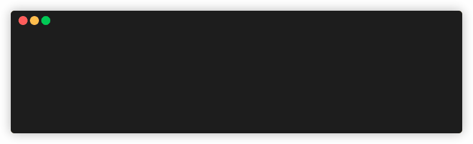

# calcli

<a href="https://github.com/haolun7788/calcli/releases" target="_blank">
  
</a>
<a href="https://github.com/haolun7788/calcli/actions/workflows/release.yml" target="_blank">  
</a>
<a href="https://github.com/haolun7788/calcli/blob/main/LICENSE" target="_blank">
  
</a>

A small, fast command-line tool for adding events to Google Calendar.

```
$ calcli add "Essay Draft" friday 10:30 1 hour
Created event: 013u9h5m06i8ptfgujatreif50
```



## Features

- **Natural-language event creation** — `calcli add "<title>" <weekday> <time> <amount> <unit> [--location X] [--calendar NAME]`
- **Custom date/time parser** — no third-party NLP date library; a small hand-written parser resolves weekday names, bare times (defaulting to PM), and durations in minutes/hours/days
- **Real OAuth2 from scratch** — the authorization-code flow (browser consent screen, local loopback callback server, token exchange, silent refresh) is implemented directly against Google's OAuth endpoints using `libcurl` and `cpp-httplib`, with no dependency on Google's official client SDKs
- **Calendar selection** — a persistent config file supports a default calendar plus named aliases, so `-c school` can stand in for a long calendar ID
- **Single self-contained binary** — statically linked (vcpkg's `x64-windows-static` triplet), so `calcli.exe` has no external DLL dependencies and runs on any Windows machine as-is
- **Bring-your-own-credentials** — each user authenticates with their own Google Cloud OAuth client; see [Setup](#setup)

## Command reference

| Command | Description |
|---|---|
| `calcli add "<title>" <weekday> <time> <amount> <unit> [--location/-l X] [--calendar/-c NAME]` | Create an event |
| `calcli auth login` | Authenticate with Google (opens a browser) |
| `calcli auth status` | Show whether credentials are currently cached |
| `calcli auth logout` | Remove cached credentials |
| `calcli calendars` | List calendars available to your account |
| `calcli config --set-default <alias-or-id>` | Set the default calendar for `add` |
| `calcli config --add-alias <name> --id <calendar-id>` | Add a named calendar alias |
| `calcli config` | Show current configuration |

### Date/time syntax

```
<weekday> <H:MM> <amount> <hour|hours|minute|minutes|day|days>
```

- Weekday names are case-insensitive; if the named day is today, it resolves to today, otherwise the next upcoming occurrence
- A bare time like `2:30` (no am/pm) defaults to **PM**
- Duration is required — e.g. `1 hour`, `30 minutes`, `2 hours`

Example: `calcli add "Essay draft" wednesday 9:00 45 minutes`

## Architecture

- **`calcli_core`** — a static library holding all logic (parsing, HTTP, auth, the Calendar API client), separate from the `calcli` executable, so the test suite links against real logic rather than duplicating it
- **`IHttpClient`** — an interface separating HTTP transport from everything that uses it, with a real `CurlHttpClient` wired to `CalendarApi`'s request-building and response-parsing.
- **OAuth (`AuthManager`)** — handles the full consent flow, CSRF protection via a random `state` parameter, token caching with restricted file permissions, and transparent refresh; callers only ever call `bearer_token()` and never think about whether a browser needs to open
- **Event serialization** — `Event` (de)serializes to/from the Calendar API's JSON shape via `nlohmann::json`, handling both `Z`-suffixed and explicit-offset RFC3339 timestamps (Google returns the latter)
- **Local-time handling** — parsed wall-clock times are converted to true UTC via `mktime` before being sent to the API, rather than being naively treated as UTC
- **Static linking** — dependencies (curl, nlohmann-json, CLI11, cpp-httplib) are built via vcpkg's static triplet and linked directly into the executable, so the shipped binary has no runtime DLL dependencies

## Setup

### Option A: Download the binary (recommended)

Grab the latest `calcli.exe` from this repo's [Releases](../../releases) page — no build tools required. Then jump to [Adding it to your PATH](#adding-it-to-your-path) below.

### Option B: Build from source

**Prerequisites:** CMake 3.21+, a C++20 compiler, [vcpkg](https://github.com/microsoft/vcpkg)

```bash
git clone https://github.com/haolun7788/calcli.git
cd calcli
cmake -B build -S . \
  -DCMAKE_TOOLCHAIN_FILE=<path-to-vcpkg>/scripts/buildsystems/vcpkg.cmake \
  -DVCPKG_TARGET_TRIPLET=x64-windows-static
cmake --build build --config Release
```
Your binary is now at `build/Release/calcli.exe`.

### Adding it to your PATH

Want to just type `calcli` from anywhere instead of typing out the full path every time?

1. Create a folder for it (if it doesn't already exist): `C:\Users\<your-name>\.local\bin`
2. Move `calcli.exe` into that folder
3. Add the folder to your PATH:
   - **Windows (all shells, persists after reboot):** *Settings → System → About → Advanced system settings → Environment Variables* → under "User variables," edit `Path` → add `C:\Users\<your-name>\.local\bin`
   - **Git Bash only:** add this line to `~/.bash_profile` (not `.bashrc` — Git Bash reads `.bash_profile` on startup):
     ```bash
     export PATH="$HOME/.local/bin:$PATH"
     ```
4. Close and reopen your terminal
5. Confirm it worked: `which calcli` (Git Bash) or `where calcli` (PowerShell/cmd) should print the path to your `.local/bin` copy

### Google Cloud setup (one-time, per user)

`calcli` uses a bring-your-own-credentials model: rather than shipping a shared, Google-verified OAuth app (which would require a hosted privacy policy, domain verification, and puts one project on the hook for every user's access), each user creates their own free OAuth client. This takes about two minutes:

1. Go to the [Google Cloud Console](https://console.cloud.google.com/), create a project (or reuse one)
2. Enable the **Google Calendar API** under *APIs & Services → Library*
3. Under *APIs & Services → Credentials*, create an **OAuth client ID** of type **Desktop app**
4. Under *OAuth consent screen*, add your own Google account as a test user

### First run

```bash
calcli auth login
```

If no credentials are found, you'll be prompted to paste your client ID and secret directly (no file download/rename/move required). A browser tab will open for you to approve access; after that, credentials are cached and refreshed automatically.

## Testing

```bash
cmake --build build
ctest --test-dir build --output-on-failure
```

Unit tests cover the date/time parser (weekday resolution, PM-default handling, week-wraparound, malformed-input rejection) using a mocked HTTP layer where relevant, no real network calls or Google account needed to run the suite. The test binary pins its timezone to UTC internally so results are deterministic across machines.

## Limitations (current scope)

- `add` only creates events - editing and deleting via the CLI aren't wired up yet (the underlying API client supports it internally)
- Date/time input requires an explicit weekday, time, and duration — no "tomorrow", relative offsets ("in 3 days"), or recurring events **yet**
- One event per invocation; no bulk/batch import
- Static-binary builds and testing have only been done on Windows/MSVC so far

## Roadmap

- GitHub Actions CI (build + test + publish releases on tag push)
- `calcli list` / `calcli delete` — expose the API client's existing list/delete support as commands
- `--desc`, `--all-day`, `--reminder` flags
- Relative date parsing ("tomorrow", "in 3 days")
- Cross-platform builds (macOS/Linux)

## License

© 2026 Hao Lun Li.

MIT - See [LICENSE](LICENSE) for details.